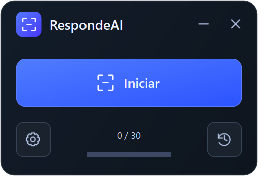
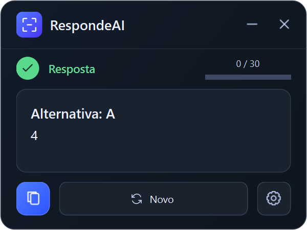
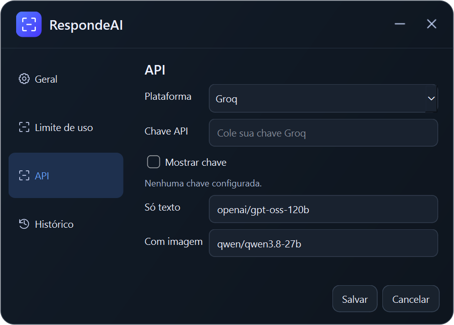
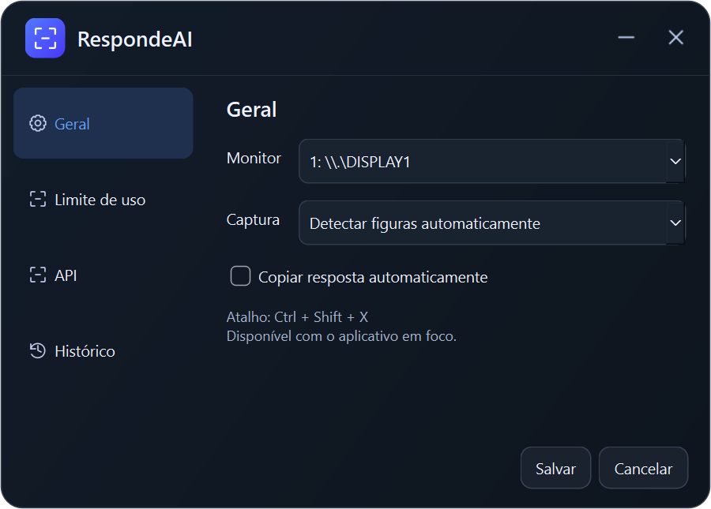
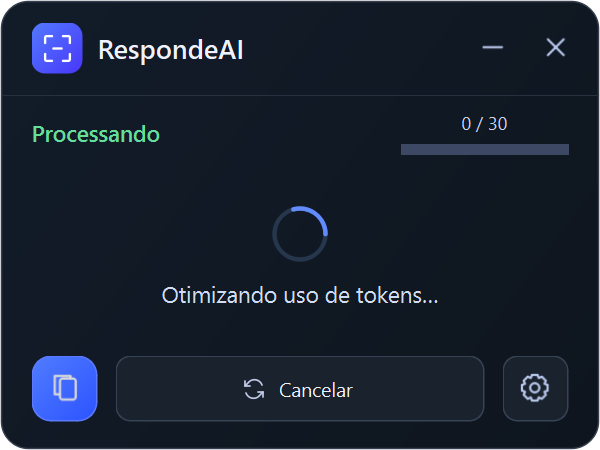

<p align="center">
  
</p>

# RespondeAI

Selecione uma pergunta na tela e receba uma resposta direta em uma janela compacta.

O RespondeAI é um aplicativo Python para desktop que transcreve capturas localmente e consulta **Groq ou Gemini** para responder. Em questões com figuras, o modelo configurado para imagens recebe a captura e responde diretamente.

<p align="center">
  
  
</p>

> As imagens deste README usam dados de demonstração. As respostas da IA podem conter erros; confira o resultado antes de utilizá-lo.

## Instalar e executar com Python

O código deste repositório é um aplicativo Python. O passo a passo abaixo foi preparado para **Windows 64 bits**, com **Python 3.14**.

### 1. Instalar o Python

1. Acesse a [página oficial do Python 3.14.7](https://www.python.org/downloads/release/python-3147/), versão utilizada neste projeto.
2. Na seção **Files**, baixe **Windows installer (64-bit)**.
3. Abra o instalador, marque **Add python.exe to PATH** e clique em **Install Now**.
4. Depois da instalação, abra uma nova janela do PowerShell e confira:

```powershell
python --version
python -m pip --version
```

O primeiro comando deve mostrar `Python 3.14.x`. Se `python` não for reconhecido, confira a opção de adicionar o Python ao PATH no instalador e reabra o terminal.

### 2. Baixar o projeto

No GitHub, clique em **Code → Download ZIP** e extraia o arquivo. Abra a pasta extraída que contém `app.py` e `requirements.txt`, clique com o botão direito em uma área vazia e escolha **Abrir no Terminal**.

Se já tiver Git instalado, também pode baixar pelo terminal:

```powershell
git clone https://github.com/pedroaugustoftw/RespondeAI.git
cd RespondeAI
```

### 3. Instalar as dependências

No terminal aberto na pasta do projeto, execute os comandos abaixo, um por vez:

```powershell
python -m venv .venv
.\.venv\Scripts\python.exe -m pip install --upgrade pip
.\.venv\Scripts\python.exe -m pip install -r requirements.txt
```

Aguarde a instalação terminar. A pasta `.venv` guarda as dependências deste projeto. Não é necessário ativar o ambiente: os comandos usam diretamente o Python dessa pasta.

### 4. Abrir o RespondeAI

```powershell
.\.venv\Scripts\python.exe app.py
```

Depois de instalar o Python, você também pode abrir **`iniciar.bat`** com dois cliques. Ele prepara o ambiente e instala as dependências, se necessário, antes de iniciar o aplicativo.

Na primeira captura, o RapidOCR pode baixar os modelos de OCR; mantenha a internet conectada e aguarde. Depois disso, a transcrição acontece localmente. As consultas a Groq ou Gemini continuam precisando de internet.

Com a janela aberta, cadastre sua chave em **Configurações → API**, conforme a próxima seção de configuração. Para abrir novamente, use `iniciar.bat` ou repita o comando de execução; não precisa reinstalar as dependências a cada uso.

Também é possível fornecer as chaves pelas variáveis `GROQ_API_KEY` ou `GEMINI_API_KEY`. Uma chave salva nas configurações tem prioridade sobre a variável correspondente. Nunca publique suas chaves no repositório.

## Executáveis disponibilizados pelo autor

Os executáveis são compilados e publicados pelo autor nas [Releases](https://github.com/pedroaugustoftw/RespondeAI/releases). Você não precisa compilar o projeto para utilizá-los.

1. Acesse **Releases** e abra uma versão disponibilizada pelo autor.
2. Em **Assets**, escolha o pacote do seu sistema e processador, conforme os arquivos disponíveis naquela versão.
3. No Windows, abra o `.exe`. No macOS, extraia o `.zip` e mova **RespondeAI.app** para Aplicativos. No Linux, extraia o `.tar.gz` e execute `./RespondeAI` dentro da pasta extraída.
4. Configure a plataforma de IA conforme as instruções abaixo.

**Os pacotes incluem o Python e os modelos de OCR.** Cada computador precisa de sua própria chave de API.

| Arquivo | Destino |
| --- | --- |
| `RespondeAI-Windows-x64.exe` | Windows em PCs Intel/AMD de 64 bits |
| `RespondeAI-Linux-x64.tar.gz` | Linux em PCs Intel/AMD de 64 bits |
| `RespondeAI-Linux-arm64.tar.gz` | Linux em computadores ARM64 |
| `RespondeAI-macOS-x64.zip` | Macs com processador Intel |
| `RespondeAI-macOS-arm64.zip` | Macs com Apple Silicon |

Use a lista de **Assets** e as notas da Release para conferir quais variantes foram publicadas e seus requisitos. Os arquivos `.sha256` permitem conferir a integridade dos downloads.

A **v1.0.1 não inclui Windows ARM64**. As versões ARM64 para Linux e macOS estão disponíveis nessa Release.

| Requisito | Detalhes |
| --- | --- |
| Sistema | Confira os requisitos e a arquitetura nas notas da Release. |
| Internet | Necessária para consultar Groq ou Gemini. |
| Chave de API | Uma chave própria da plataforma selecionada, com acesso ao modelo e cota disponível. |
| OCR | Incluído no executável; a transcrição acontece no computador. |

A abertura pode levar alguns segundos, pois o pacote extrai componentes para uma pasta temporária do sistema. Não há versão para iOS/iPhone.

No **macOS**, permita a gravação/captura da tela para o RespondeAI nas configurações de privacidade do sistema. Os pacotes não possuem notarização Apple. No **Linux**, use uma sessão **X11/Xorg**, com um cofre de credenciais disponível e desbloqueado (Secret Service ou KWallet). A captura sob Wayland ainda não é suportada por este fluxo.

## Configurar Groq ou Gemini

Clique na **engrenagem → API**.

<p align="center">
  
</p>

1. Em **Plataforma**, escolha **Groq** ou **Gemini**.
2. Cole sua **Chave API**. Use **Mostrar chave** para conferir o conteúdo.
3. Em **Só texto**, informe o identificador do modelo que responderá às questões sem figura.
4. Em **Com imagem**, informe um modelo da mesma plataforma que aceite imagens.
5. Clique em **Salvar**.

Você pode obter uma chave no [console da Groq](https://console.groq.com/keys) ou no [Google AI Studio](https://aistudio.google.com/apikey).

As chaves e os modelos de cada plataforma ficam guardados separadamente. Você pode alternar entre elas sem preencher tudo novamente. O aplicativo usa a plataforma selecionada; não consulta ambas para a mesma pergunta.

Use o **identificador do modelo**, não o endereço de uma página. A disponibilidade, a gratuidade e as cotas dependem da plataforma e da sua conta. O aplicativo não fornece uma chave ou créditos de API.

## Responder a uma pergunta

1. Deixe a pergunta e todas as alternativas visíveis na tela.
2. No RespondeAI, clique em **Iniciar** ou **Novo**.
3. O aplicativo minimiza para você selecionar a área: clique e arraste sobre a pergunta inteira.
4. Solte o mouse e aguarde o processamento. Para desistir da seleção, pressione **Esc**.
5. A resposta aparece no aplicativo. Clique no **ícone de copiar** para copiá-la ou em **Novo** para capturar outra pergunta.

A janela permanece sobre os outros aplicativos até você minimizá-la. O atalho **Ctrl + Shift + X** inicia uma captura quando o RespondeAI está em foco.

Para melhorar a leitura, amplie textos pequenos e inclua o enunciado, as alternativas e as figuras necessárias na mesma seleção.

## Texto e figuras

Em **Configurações → Geral**, escolha o monitor e o modo de captura:

<p align="center">
  
</p>

| Modo | Comportamento |
| --- | --- |
| **Detectar figuras automaticamente** | Executa OCR local e procura regiões visuais. Envia a captura se detectar uma figura. |
| **Somente texto (não enviar imagem)** | Envia apenas o texto transcrito pelo OCR local. |
| **A questão contém figura ou gráfico** | Envia a captura completa e o texto transcrito ao modelo de imagens. |

A detecção automática pode errar. Se a questão tiver um gráfico ou uma figura importante que não foi reconhecida, selecione o modo manual correspondente.

Quando uma imagem é enviada, ela vai diretamente ao modelo que responde à questão. Não há uma etapa de descrição por um modelo seguida de uma segunda consulta para obter a resposta.

Você também pode ativar **Copiar resposta automaticamente** nessa tela.

## Carregamento e limites

<p align="center">
  
</p>

Em **Configurações → Limite de uso**, defina o **teto diário local**. O contador reúne as tentativas das duas plataformas neste computador; ele não representa o saldo informado pelos provedores. Reenvios e chamadas que falham também podem consumir esse teto.

- **Limite temporário de segundos ou minutos:** o app mostra o carregamento, espera e tenta novamente. Você pode cancelar a espera.
- **Limite diário informado pela plataforma:** o app avisa e interrompe os reenvios automáticos.
- **Teto diário local:** renova à meia-noite do computador.

A mensagem **“Otimizando uso de tokens…”** também aparece durante a espera pela liberação de cota. Ela não significa que o aplicativo consegue remover o limite da plataforma.

Uma resposta já salva pode ser reutilizada para a mesma captura e configuração, sem nova chamada à API.

## Histórico e dados locais

Use o **ícone de histórico** na tela inicial ou **Configurações → Histórico → Abrir histórico** para consultar respostas anteriores.

O botão **Apagar histórico e cache** remove as respostas salvas e mantém o contador de uso.

- As configurações e o histórico ficam em `%LOCALAPPDATA%\RespondeAI` no Windows e na pasta de dados de aplicativo definida pelo sistema no Linux/macOS.
- As chaves cadastradas ficam no cofre de credenciais do sistema.
- As capturas não são gravadas pelo aplicativo em arquivos no disco.
- O texto transcrito é enviado à plataforma escolhida. Quando o modo de captura indicar uma figura, a captura completa também é enviada.
- O executável distribuído não inclui suas chaves ou seu histórico. Cada pessoa configura a própria conta.

## Problemas comuns

| Problema | O que conferir |
| --- | --- |
| Chave inválida ou sem permissão | Confira a plataforma escolhida e a chave em **Configurações → API**. |
| Modelo inexistente ou erro de compatibilidade | Confira o identificador, o acesso na sua conta e se o modelo de imagens aceita capturas. |
| OCR não encontrou texto | Amplie a pergunta e selecione uma área nítida. |
| A resposta ignorou uma figura | Selecione **A questão contém figura ou gráfico** e capture novamente. |
| Carregamento após aviso de cota | Aguarde a liberação do limite temporário ou clique em **Cancelar**. |
| Resposta incorreta ou incompleta | Confira se a captura inclui todo o enunciado e as alternativas; compare o resultado com uma fonte confiável. |
